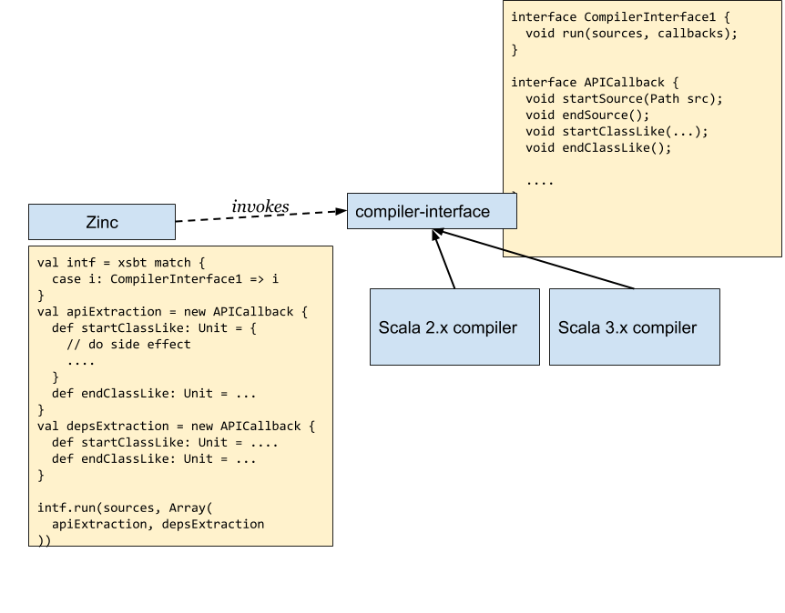

The compiler interface is a binary contract between Zinc and the Scala
compiler.  The interface is written in Java.  All details are subject
to change.

### About compiler bridges

An implementation of a compiler interface specific to a Scala version is called a compiler bridge.
A build tool is responsible for locating a compiler bridge to use Zinc.

### Relationships between the components

The following diagram outlines the relationship between the components:

Scala 2.x and Scala 3.x compilers expose tree walking interface `APICallback`, and Zinc registers the callbacks to gather data during compilation.
